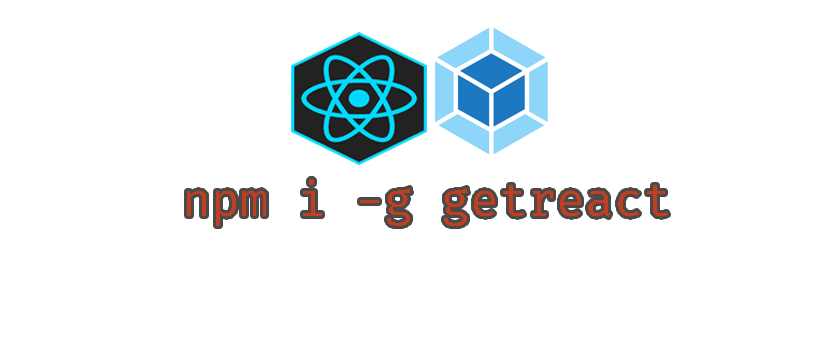

<p align="center" ></p>

# Painless webpack react cli

 CLI tool for Mac/Windows/Linux. Just `npm i -g getreact` and run `getreact new`


# Quick start

Install the getreact command-line tool on Mac/Windows/Linux:

```bash
npm i -g getreact
```

Then run `getreact` for help, or `getreact new` to start a new project.

Main project [webpack-react](https://github.com/code4mk/webpack-react)

[]()
<a href="https://hellolaravel.org" >
<a href="https://twitter.com/code4mk" >
